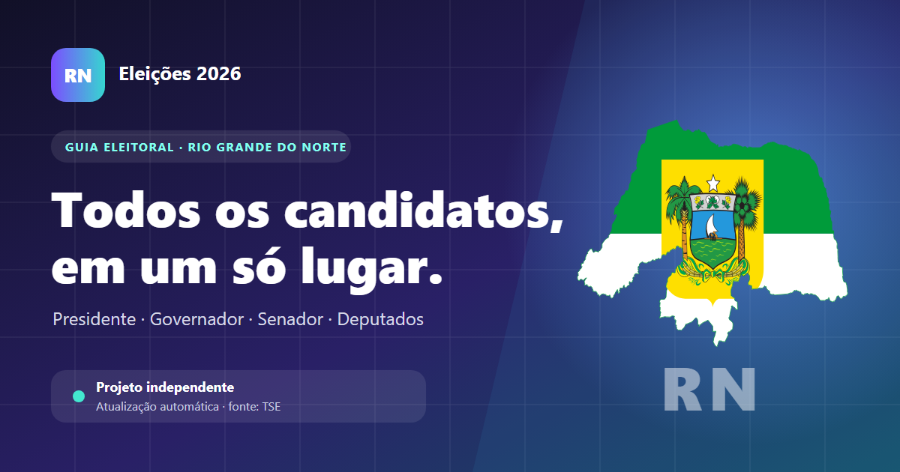

# Candidatos 2026 — Rio Grande do Norte

[](https://candidatos-rn-2026.netlify.app/)
[](https://app.netlify.com/projects/candidatos-rn-2026/deploys)
[](https://github.com/MagnosLima/eleicoes-2026-rn/actions/workflows/atualizar-candidatos.yml)

Guia eleitoral independente que reúne, em uma interface acessível e responsiva, as candidaturas à Presidência da República e aos cargos do Rio Grande do Norte nas Eleições 2026.

**[Acessar a demonstração](https://candidatos-rn-2026.netlify.app/)**



## Recursos

- Busca por nome, número, partido, coligação ou vice.
- Filtros por cargo e partido.
- Situação atual da candidatura e redes sociais declaradas ao TSE.
- Fotos oficiais com alternativa textual quando a imagem não está disponível.
- Layout responsivo, navegação por teclado e versão otimizada para impressão.
- Cópia local de contingência para indisponibilidades externas.

## Atualização automática

O workflow `.github/workflows/atualizar-candidatos.yml` é executado a cada 30 minutos. Ele consulta o DivulgaCand e os Dados Abertos do TSE, compara o resultado com a versão publicada e cria um commit somente quando encontra mudanças. Esse commit aciona um novo deploy no Netlify.

```text
TSE → GitHub Actions → data/candidatos.json → Netlify
```

O TSE informa que seus arquivos de Dados Abertos são atualizados quatro vezes ao dia. A execução mais frequente permite detectar cada nova carga sem criar commits desnecessários.

## Tecnologias

- HTML, CSS e JavaScript sem framework
- Node.js para coleta e normalização
- GitHub Actions para automação
- Netlify para hospedagem e CDN

## Executar localmente

```bash
npm install
npm run update-data
npx serve .
```

## Fonte e responsabilidade

Este é um projeto independente, sem vínculo com a Justiça Eleitoral e sem finalidade de recomendar candidaturas. A fonte primária é o [Portal de Dados Abertos do TSE](https://dadosabertos.tse.jus.br/pt_BR/dataset/candidatos-2026). Situações podem mudar; para confirmação oficial, consulte o [DivulgaCand](https://divulgacandcontas.tse.jus.br/divulga/).

O código-fonte está sob licença MIT. Dados, fotos e demais conteúdos provenientes do TSE permanecem sujeitos aos termos e créditos indicados pelo órgão. O mapa do RN conserva o crédito informado no rodapé da página.

## Autor

[Magnos Lima](https://github.com/MagnosLima) · [Instagram](https://www.instagram.com/mag.lima.ig/)
